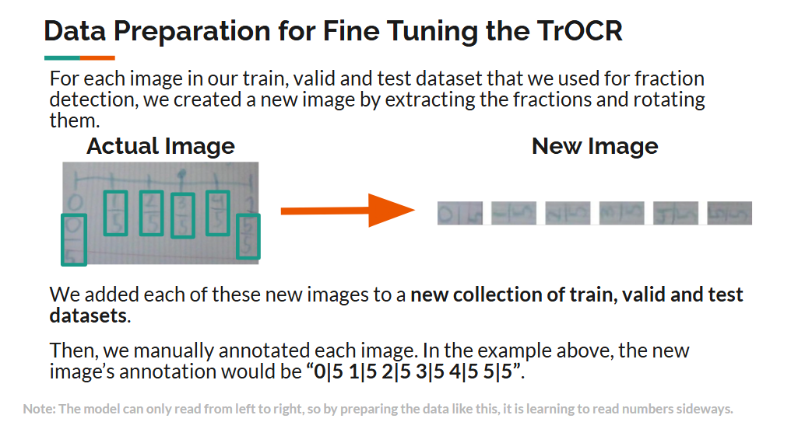
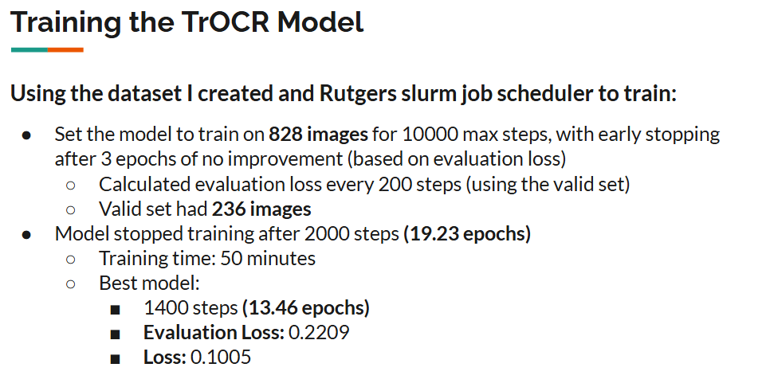
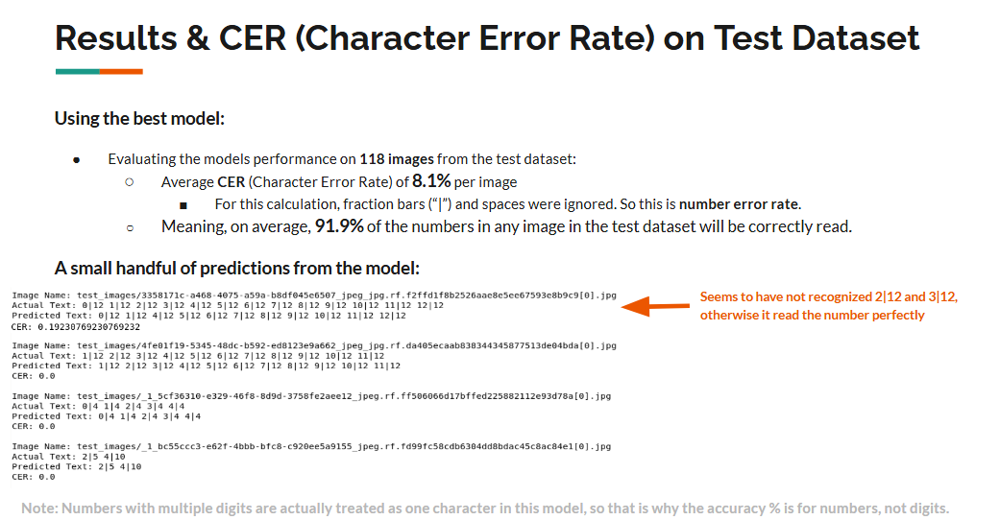

# TrOCR number recognition model for fraction number lines

Project as described in conference presentation Karakashian, A., Zhang, D., Lu, Q., Wang, Z., & Li, M. Transformer approach to fraction recognition on written responses in students with and without disabilities. CEC, 2025, Baltimore.

## How to Use

Example images are not available for testing, but to read fractions from a number line, format images as seen in the data preparation section and provide ground truth and image paths in a .csv file. More information about .csv formatting is in the evaluate_model.py file. 

You may download the model from [here](https://drive.google.com/file/d/1ofcGgBAEHkxS5Zif7y7Pp73jOoz-23f6/view). From this zip, move model.safetensors and optimizer.pt into the main directory and use evaluate_model.py to test out the model.

## Project Steps

### Data preparation

### Training

### Results
